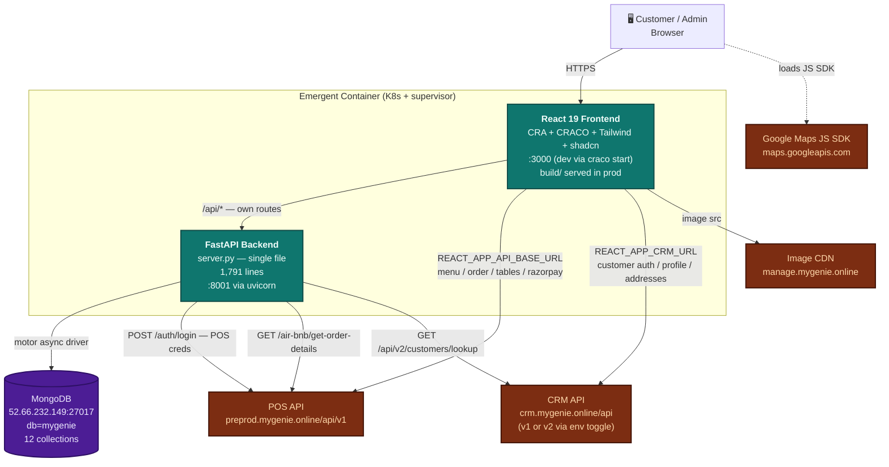
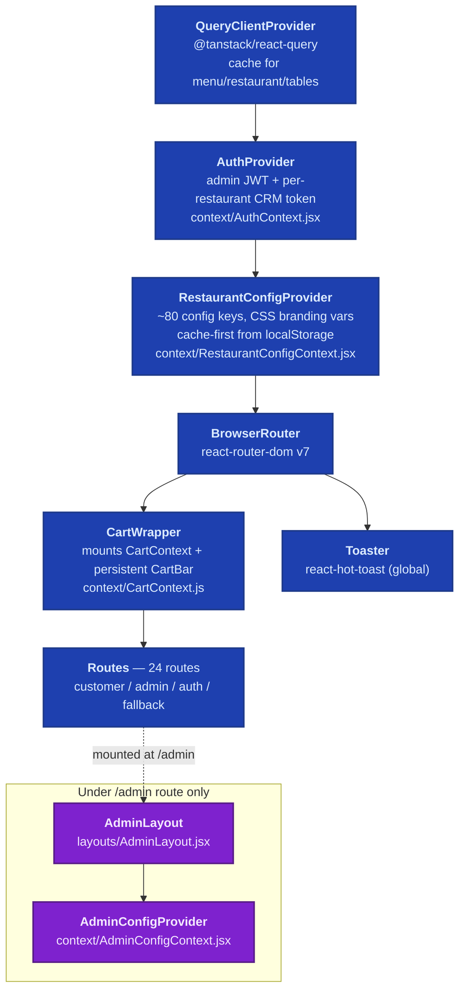
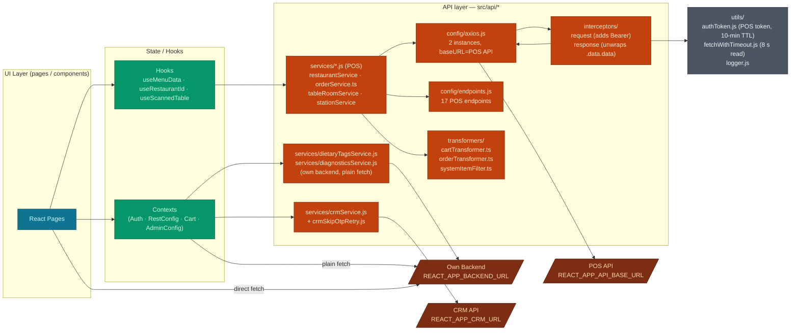
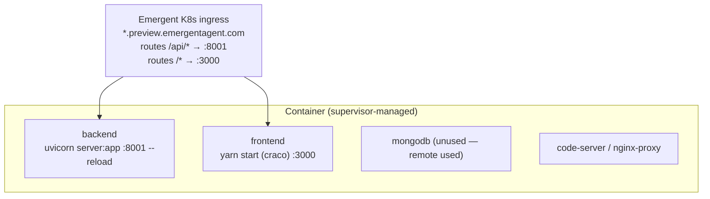

# MyGenie Customer App — Architecture Diagram (2026-02)

**Status:** Code-verified from `main` HEAD (post-clone, 2026-02)
**Prior baselines:** `ARCHITECTURE_v2.md` (partially verified, drift detected), `current-state/CURRENT_ARCHITECTURE.md` (partially verified, references `server.py:1-1610` but file is now 1,791 lines)
**Method:** Static parse of code — every edge traced to a file + line number below
**Diagram format:** Mermaid (renders inline on GitHub, editable, diffable)

> Read this alongside `DATA_FLOW_DIAGRAM_2026-02.md` (sequence diagrams for the 8 critical flows) and `BASELINE_DELTA_2026-02.md` (what changed vs old baseline).

---

## 1. System Context (who talks to whom)

### Source-of-truth table for every edge above

| Edge | Verified in |
|---|---|
| Browser → Frontend (HTTPS) | supervisor conf: `yarn start` (`frontend/package.json` scripts) |
| Frontend → Backend (`/api/*`) | 17 files reference `process.env.REACT_APP_BACKEND_URL` — `AuthContext.jsx:7`, `RestaurantConfigContext.jsx:9`, `AdminConfigContext.jsx:9`, `Login.jsx:10`, `LandingPage.jsx:81, 595`, `ReviewOrder.jsx:139, 411`, `AdminSettings.jsx:36`, `AdminQRPage.jsx:20`, `FeedbackPage.jsx:9`, `AdminSettings/ContentTab.jsx:44`, `hooks/useMenuData.js:417`, `api/services/diagnosticsService.js:8`, `api/services/dietaryTagsService.js:3`, `utils/authToken.js:88` |
| Frontend → POS (`REACT_APP_API_BASE_URL`) | `api/config/axios.js:26` (`baseURL`), `api/config/endpoints.js:9-53` (17 endpoints) |
| Frontend → CRM (`REACT_APP_CRM_URL`) | `api/services/crmService.js:9, 88, 112` |
| Frontend → Image CDN | `REACT_APP_IMAGE_BASE_URL` in `.env` — consumed by menu item image URLs |
| Frontend → Google Maps | `pages/DeliveryAddress.jsx:3, 13` |
| Backend → Mongo (motor) | `server.py:29-39` (`AsyncIOMotorClient`), 12 collections used |
| Backend → POS `/auth/login` (POS token proxy) | `server.py:828-859` — `@api_router.post("/pos/auth-token")` — reads `MYGENIE_POS_LOGIN_PHONE/_PASSWORD` env |
| Backend → POS `/air-bnb/get-order-details` | `server.py:861-882` — `@air_bnb_router.get("/get-order-details/{order_id}")` |
| Backend → CRM v2 (customer-lookup) | `server.py:898-951` — `@api_router.get("/customer-lookup/{restaurant_id}")` — replaces `/api/v1` with `/api/v2` |

---

## 2. Frontend Component Architecture

### 2.1 Provider Stack (order matters — do NOT reorder)

Verified: `frontend/src/App.js:56-143`.

⚠ **Anti-pattern intentional** — inner providers depend on outer ones. AuthProvider reads no config; RestaurantConfigProvider reads `restaurant_context` from Auth; CartWrapper depends on both (checked in `App.js`).

### 2.2 Frontend API Layer (three destinations)

⚠ **Mixed HTTP style** — POS services use axios+interceptors; CRM & own-backend calls use plain `fetch()`. This is intentional per architecture doc but is a known drift risk. The interceptors' request logger only fires on POS calls.

### 2.3 Frontend routes (verified `App.js:63-122`)

| Route | Component | Notes |
|---|---|---|
| `/login` | `Login` | Admin login |
| `/profile` | `Profile` | Post-login profile |
| `/admin` | `AdminLayout` → `/admin/settings` redirect | Wraps `AdminConfigProvider` |
| `/admin/settings` | `AdminSettingsPage` | + `branding` `visibility` `banners` `content` `menu` `dietary` `qr-scanners` |
| `/:restaurantId` | `LandingPage` | Customer entry — phone + name capture |
| `/:restaurantId/password-setup` | `PasswordSetup` | |
| `/:restaurantId/delivery-address` | `DeliveryAddress` | Uses Google Maps |
| `/:restaurantId/menu` and `/menu/:stationId` | `MenuItems` | |
| `/:restaurantId/stations` | `DiningMenu` | |
| `/:restaurantId/about` `/contact` `/feedback` | Static-ish pages | |
| `/:restaurantId/review-order` and `/:stationId/review-order` | `ReviewOrder` | ⚠ CRITICAL — payment orchestration |
| `/:restaurantId/order-success` | `OrderSuccess` | ⚠ Polling logic |
| Fallback `/`, `/stations`, `/menu`, `/menu/:stationId` | `LandingPage` / `DiningMenu` / `MenuItems` | Subdomain mode + hardcoded default `478` in `useRestaurantId.js` |

---

## 3. Backend Component Architecture

Verified `server.py`. All routers listed with **exact line numbers**.

```mermaid
graph TB
    Uvicorn["uvicorn :8001<br/>--reload (dev)"]
    App["<b>FastAPI app</b><br/>server.py:67"]
    CORS["CORSMiddleware<br/>server.py:1774-1781<br/>origins = env CORS_ORIGINS or '*'"]
    Uploads["/api/uploads static mount<br/>server.py:70<br/>→ backend/uploads/"]

    subgraph RouterTree["api_router (prefix /api) — server.py:73"]
        Auth["<b>auth_router</b> /auth<br/>server.py:74<br/>7 routes"]
        Cust["<b>customer_router</b> /customer<br/>server.py:75<br/>7 routes"]
        Cfg["<b>config_router</b> /config<br/>server.py:76<br/>10 routes"]
        Up["<b>upload_router</b> /upload<br/>server.py:77<br/>1 route"]
        Diet["<b>dietary_router</b> /dietary-tags<br/>server.py:78<br/>3 routes"]
        Diag["<b>diagnostics_router</b> /diagnostics<br/>server.py:79<br/>1 route (CR-2026-05-30-002)"]
        AirBnb["<b>air_bnb_router</b> /air-bnb<br/>server.py:861<br/>1 route"]
        Misc["Inline on api_router:<br/>/ · /healthz · /status ·<br/>/loyalty-settings/{rid} ·<br/>/customer-lookup/{rid} ·<br/>/pos/auth-token ·<br/>/table-config ·<br/>/docs/* (8 markdown routes)"]
    end

    subgraph DBLayer["MongoDB — motor async"]
        Mongo[("db.<collection>")]
        Col1["users"]
        Col2["customers"]
        Col3["customer_app_config"]
        Col4["orders"]
        Col5["loyalty_settings"]
        Col6["points_transactions"]
        Col7["wallet_transactions"]
        Col8["coupons"]
        Col9["dietary_tags_mapping"]
        Col10["feedback"]
        Col11["status_checks"]
        Col12["db.command (admin/ping)"]
    end

    Uvicorn --> App
    App --> CORS
    App --> Uploads
    App --> RouterTree
    RouterTree --> Mongo
    Mongo --- Col1 & Col2 & Col3 & Col4 & Col5 & Col6 & Col7 & Col8 & Col9 & Col10 & Col11 & Col12

    Auth -->|POST /auth/login — POS creds| POSext[/"POS API<br/>preprod.mygenie.online"/]
    Misc -->|/pos/auth-token proxy| POSext
    AirBnb -->|/air-bnb/get-order-details| POSext
    Misc -->|/customer-lookup uses CRM v2| CRMext[/"CRM API"/]

    classDef app fill:#065f46,stroke:#022c22,color:#d1fae5,stroke-width:2px
    classDef router fill:#1e40af,stroke:#1e3a8a,color:#dbeafe
    classDef store fill:#4c1d95,stroke:#2e1065,color:#ede9fe
    classDef ext fill:#7c2d12,stroke:#431407,color:#fed7aa

    class App,Uvicorn,CORS,Uploads app
    class Auth,Cust,Cfg,Up,Diet,Diag,AirBnb,Misc,RouterTree router
    class Mongo,Col1,Col2,Col3,Col4,Col5,Col6,Col7,Col8,Col9,Col10,Col11,Col12 store
    class POSext,CRMext ext
```

### 3.1 Backend endpoint inventory (41 routes)

| Router | Method | Path | Line | Auth |
|---|---|---|---|---|
| auth | POST | `/api/auth/send-otp` | 436 | — |
| auth | POST | `/api/auth/check-customer` | 467 | — |
| auth | POST | `/api/auth/login` | 501 | — (issues JWT) |
| auth | GET | `/api/auth/me` | 618 | JWT |
| auth | POST | `/api/auth/set-password` | 626 | JWT |
| auth | POST | `/api/auth/verify-password` | 697 | JWT |
| auth | POST | `/api/auth/reset-password` | 742 | JWT |
| customer | GET | `/api/customer/profile` | 782 | JWT |
| customer | GET | `/api/customer/orders` | 802 | JWT |
| customer | GET | `/api/customer/points` | 954 | JWT |
| customer | GET | `/api/customer/wallet` | 978 | JWT |
| customer | GET | `/api/customer/coupons` | 998 | JWT |
| customer | PUT | `/api/customer/profile` | 1016 | JWT |
| config | GET | `/api/config/{rid}` | 1042 | public (customer app) |
| config | PUT | `/api/config/` | 1166 | JWT (restaurant) |
| config | POST | `/api/config/banners` | 1192 | JWT (restaurant) |
| config | PUT | `/api/config/banners/{id}` | 1217 | JWT |
| config | DELETE | `/api/config/banners/{id}` | 1241 | JWT |
| config | POST | `/api/config/feedback` | 1270 | JWT |
| config | GET | `/api/config/feedback/{rid}` | 1284 | JWT |
| config | POST | `/api/config/pages` | 1308 | JWT |
| config | PUT | `/api/config/pages/{id}` | 1329 | JWT |
| config | DELETE | `/api/config/pages/{id}` | 1347 | JWT |
| upload | POST | `/api/upload/image` | 1368 | JWT (restaurant) |
| api_router | POST | `/api/pos/auth-token` | 828 | server-side POS creds (CR-2026-07-03-000) |
| air_bnb | GET | `/api/air-bnb/get-order-details/{oid}` | 863 | proxies POS |
| api_router | GET | `/api/table-config` | 884 | X-POS-Token header |
| api_router | GET | `/api/` | 1404 | health/welcome |
| api_router | GET | `/api/healthz` | 1408 | **dedicated health (mongo ping)** |
| api_router | POST | `/api/status` | 1431 | status_checks write |
| api_router | GET | `/api/status` | 1440 | status_checks read |
| api_router | GET | `/api/loyalty-settings/{rid}` | 1452 | public |
| api_router | GET | `/api/customer-lookup/{rid}` | 1487 | → CRM v2 |
| dietary | GET | `/api/dietary-tags/available` | 1543 | — |
| dietary | GET | `/api/dietary-tags/{rid}` | 1548 | — |
| dietary | PUT | `/api/dietary-tags/{rid}` | 1569 | JWT |
| diagnostics | POST | `/api/diagnostics/non-qr-block` | 1635 | — (telemetry) |
| api_router | GET | `/api/docs/bug-tracker` .. `/api/docs/test-cases` | 1699-1762 | serves markdown docs (8 routes) |

### 3.2 Backend outbound calls (only 4 destinations)

| Line | Client | Destination | Purpose |
|---|---|---|---|
| 402-405 | `httpx.AsyncClient(timeout=30)` | `{MYGENIE_API_URL}/auth/login` | Send-OTP flow gets a POS session first |
| 842-846 | `httpx.AsyncClient(timeout=15)` | `{MYGENIE_API_URL}/auth/login` | `/api/pos/auth-token` proxy (CR-2026-07-03-000) |
| 869-872 | `httpx.AsyncClient(timeout=30)` | `{MYGENIE_API_URL}/air-bnb/get-order-details/{oid}` | Order detail lookup |
| 903-906 | `httpx.AsyncClient(timeout=30)` | `{CRM v2 base}` (built by replacing `/api/v1` with `/api/v2`) | Customer lookup |

⚠ **No global outbound HTTP client / no retry policy** — each call opens its own `httpx.AsyncClient`. No circuit-breaker layer.

---

## 4. State / Storage (browser side)

All localStorage keys currently written or read by frontend code (verified via grep):

| Key | Written by | Purpose | Scope | Landmine? |
|---|---|---|---|---|
| `auth_token` | AuthContext | Admin JWT (own backend) | global | |
| `crm_token_${restaurantId}` | AuthContext (`crmTokenKey`) | Customer CRM token, per restaurant | per rid | |
| `crm_token` | legacy path | migrated on load into `crm_token_${rid}` | global (legacy) | ⚠ do NOT remove migration |
| `restaurant_context` | AuthContext | `{restaurant_id, pos_id}` from admin login | global | |
| `cart_${rid}` | CartContext | Cart items + 3-hour `expiresAt` | per rid | |
| `editOrder_${rid}` | CartContext | Edit-order session | per rid | |
| `delivery_${rid}` | CartContext / DeliveryAddress | Delivery address | per rid | |
| `restaurant_config_${rid}` | RestaurantConfigContext | Cache-first config blob | per rid | |
| `prevRestaurantId` | CartContext | Detects restaurant switch → clears prev cart | global | |
| `order_auth_token` | `utils/authToken.js:6` | POS token issued via backend proxy | global | ⚠ 10-min TTL despite comment saying 30 min |
| `order_token_expiry` | `utils/authToken.js:7` | POS token expiry timestamp | global | |
| `pos_token` | (grep shows read/write) | Legacy POS token key | global | ⚠ Coexists with `order_auth_token` — potential source of ambiguity |
| `guestCustomer` | Landing/Auth flow | Guest capture before OTP | global | |
| `restaurant_name_${rid}` | Landing | Cached display name | per rid | |
| `authToken` (camelCase) | (grep shows some reads) | ⚠ Different key from `auth_token` — check for accidental writes | global | ⚠ potential typo bug |
| `refreshToken` | grep-visible | JWT refresh token (orderService uses `/auth/refresh`) | global | |
| `debug:*` / `debug:order` / `debug:razorpay` | logger | Runtime debug flag | global | dev-only |

⚠ **The Agent Prompt Part B §8 lists 9 localStorage keys. Actual count in code is 15+.** Several are undocumented (`order_auth_token`, `pos_token`, `guestCustomer`, `refreshToken`, `restaurant_name_*`, `authToken` camelCase variant).

---

## 5. Environment Variables — who reads what

### Backend (`/app/backend/.env`)

| Var | Read at | Fails-fast if missing? |
|---|---|---|
| `MONGO_URL` | `server.py:24` | YES (KeyError) |
| `DB_NAME` | `server.py:39` | YES (KeyError) |
| `JWT_SECRET` | `server.py:42-44` | YES (ValueError) |
| `MYGENIE_API_URL` | `server.py:52-54` | YES (ValueError) |
| `MYGENIE_POS_LOGIN_PHONE` | `server.py:58-60` | YES (ValueError) |
| `MYGENIE_POS_LOGIN_PASSWORD` | `server.py:62-64` | YES (ValueError) |
| `CORS_ORIGINS` | `server.py:1778` | defaults to `*` |

### Frontend (`/app/frontend/.env`)

| Var | Read where | Effect if missing |
|---|---|---|
| `REACT_APP_BACKEND_URL` | 17 files (listed above) | own-backend calls fail silently (defaults to `''`) or logs CRITICAL in `authToken.js:88` |
| `REACT_APP_API_BASE_URL` | `axios.js:12-26`, `endpoints.js:9-11` | logs CRITICAL; POS calls fail |
| `REACT_APP_CRM_URL` | `crmService.js:9-12` | logs CRITICAL; CRM calls fail |
| `REACT_APP_CRM_API_KEY` | `crmService.js:21-26` | per-restaurant JSON `{rid: apiKey}`; missing → warn per call |
| `REACT_APP_CRM_API_VERSION` | `crmService.js:63-65` | defaults to `v1`; `v2` toggles `/customer/*` vs `/scan/*` endpoints |
| `REACT_APP_IMAGE_BASE_URL` | image src builders | broken images |
| `REACT_APP_LOGIN_PHONE` / `_PASSWORD` | `Login.jsx` | pre-fills login form (⚠ shipped in JS bundle) |
| `REACT_APP_GOOGLE_MAPS_API_KEY` | `DeliveryAddress.jsx:13` | Google Maps fails to load |

---

## 6. Landmines encoded in the diagram (⚠ DO NOT "fix")

These are marked with ⚠ throughout the doc. Reproducing here for a single source of scan:

1. ⚠ **Provider stack order is dependency-critical** — reordering breaks `restaurant_context` propagation.
2. ⚠ **Mixed HTTP style (axios vs fetch)** is intentional per architecture doc; POS = axios, CRM & own-BE = fetch. Interceptor logger only sees POS calls.
3. ⚠ **`payment_method: "cash_on_delivery"` is hardcoded** in `orderService.ts:386, 523`; `payment_type` carries the real selection. BUG-007 P1 parked.
4. ⚠ **Restaurant 716 hardcoded branch** in `ReviewOrder.jsx` — BUG-006 parked intentionally.
5. ⚠ **`finalTableId='0'` is a special trigger** in table scan logic, not a bug.
6. ⚠ **`isOn()` returns `true` unless explicitly `false`** — inverting default flips visibility of ~40 UI elements.
7. ⚠ **Legacy `crm_token` (non-scoped) migration path** in AuthContext must stay — users' browsers still have it.
8. ⚠ **`authToken.js` comment says "30 min"** but code sets `10 * 60 * 1000` (10 min). Inconsistency — either comment or constant is stale.
9. ⚠ **`pos_token` and `order_auth_token` both exist** in localStorage grep — likely one is legacy but both are read/written. Needs audit.
10. ⚠ **`REACT_APP_LOGIN_PHONE` / `_PASSWORD` are shipped in the frontend bundle** — visible to any user with dev-tools. Intentional for preprod only.

---

## 7. Deployment topology (this container)

Config source: `/etc/supervisor/conf.d/*.conf`.

Local Mongo container is running but **unused** — app connects to remote `52.66.232.149:27017`.

---

*End of Architecture Diagram 2026-02. Companion docs:*
- *`DATA_FLOW_DIAGRAM_2026-02.md`  — 8 sequence diagrams (auth, order, cart, config, delivery, upload, QR scan, admin)*
- *`BASELINE_DELTA_2026-02.md` — what changed vs `ARCHITECTURE_v2.md`*
