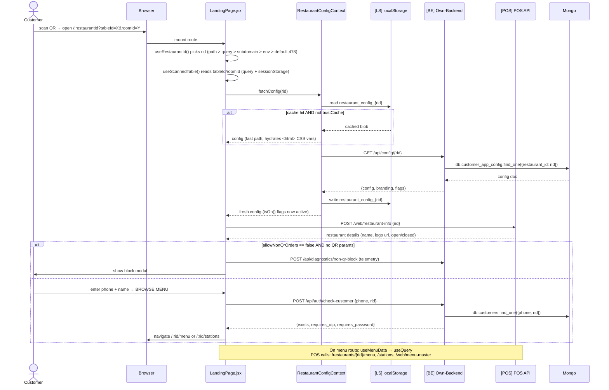
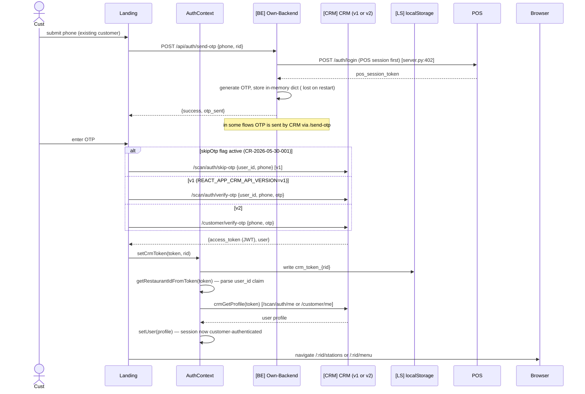
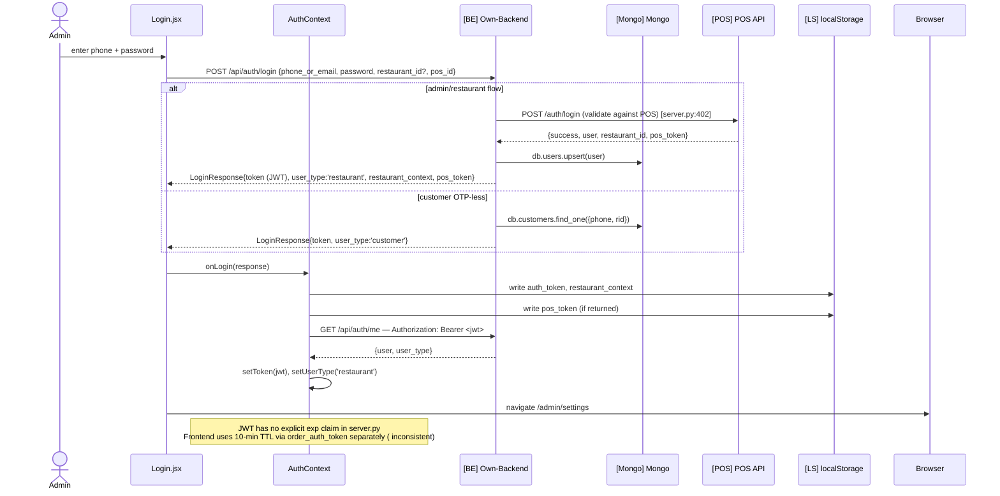
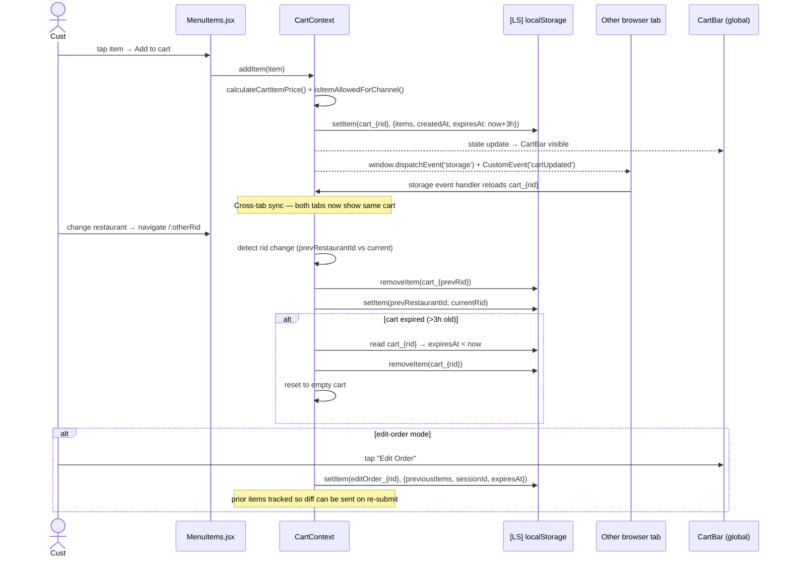
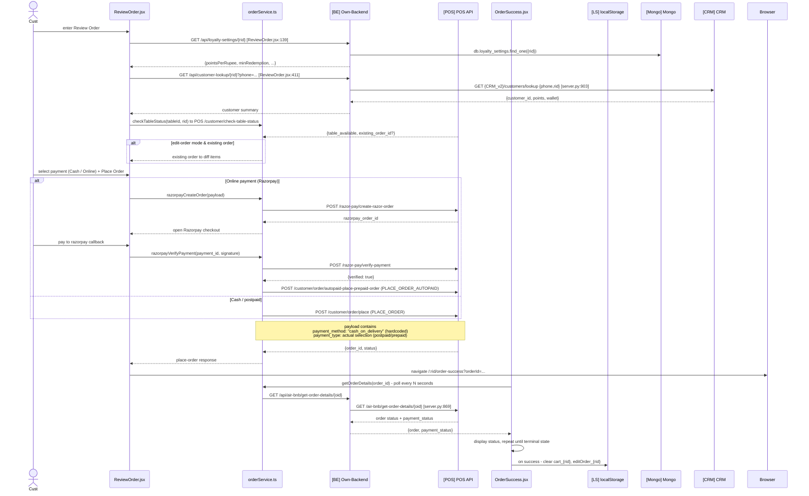
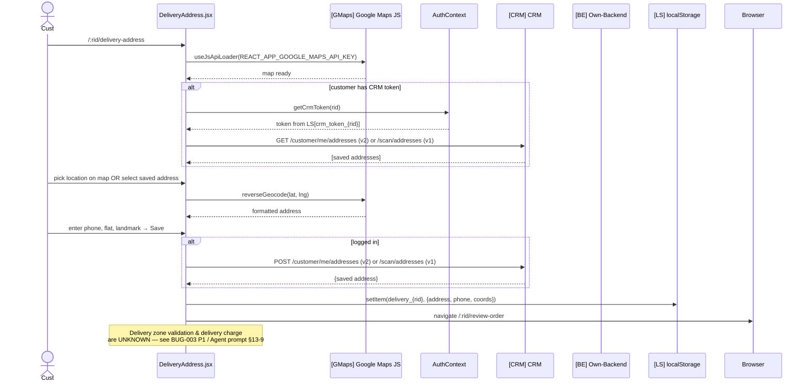
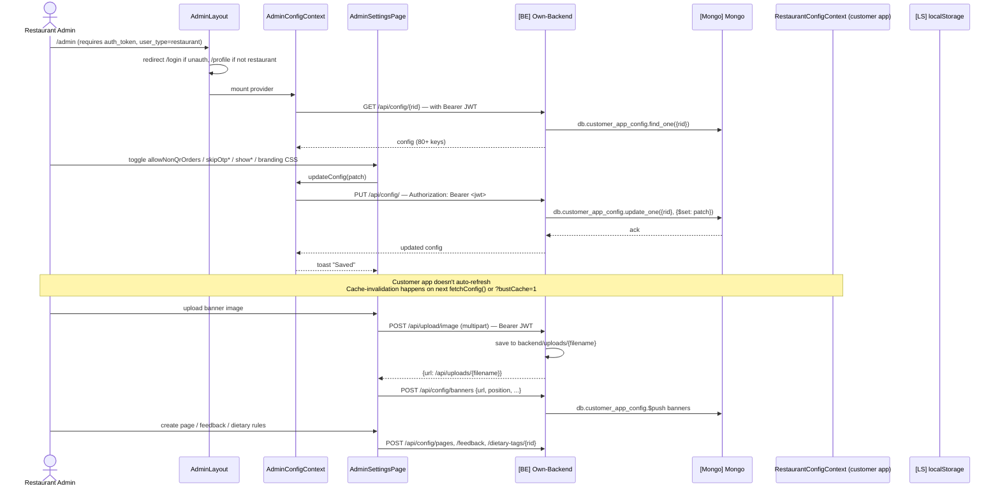
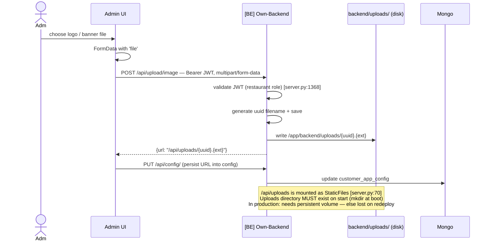
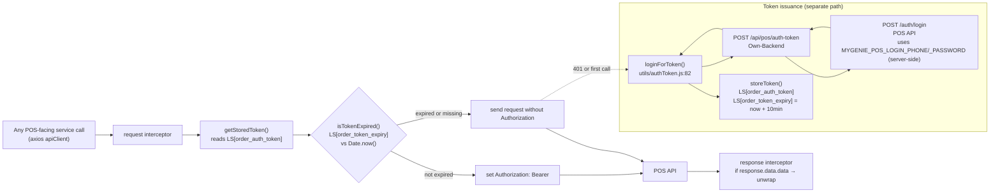

# MyGenie Customer App — Data Flow Diagrams (2026-02)

**Status:** Code-verified from `main` HEAD (post-clone, 2026-02)
**Method:** Mermaid `sequenceDiagram` for each of the 8 business-critical flows (see Agent Prompt Part B §5). Every arrow traceable to file + line.
**Companion docs:** `ARCHITECTURE_DIAGRAM_2026-02.md` (container/component view), `BASELINE_DELTA_2026-02.md`

Notation:
- 🟦 **Own-Backend** = FastAPI at `REACT_APP_BACKEND_URL`
- 🟧 **POS** = `REACT_APP_API_BASE_URL` (preprod.mygenie.online/api/v1)
- 🟪 **CRM** = `REACT_APP_CRM_URL` (v1 uses `/scan/*`, v2 uses `/customer/*`)
- 🗄 **LS** = localStorage
- 🟨 **Mongo** = 12-collection remote MongoDB

---

## Flow 1 — QR Scan → Landing → Menu Browse

Entry point for every customer. Traced from `pages/LandingPage.jsx`, `hooks/useMenuData.js`, `context/RestaurantConfigContext.jsx`, `utils/useRestaurantId.js`.

**Key files:** `LandingPage.jsx:81, 595`, `useMenuData.js:174, 240, 329, 387, 417-435`, `RestaurantConfigContext.jsx:152-302`, `utils/useRestaurantId.js:68-128`.

---

## Flow 2 — Customer OTP Login (issues CRM token)

Traced from `LandingPage.jsx`, `AuthContext.jsx`, `crmService.js`.

**Key files:** `AuthContext.jsx:8-24, 30-70`, `crmService.js:210-438` (10+ CRM endpoints), `LandingPage.jsx`.

⚠ **OTP is stored in an in-memory dict on the backend** — server restart wipes pending OTPs. This is documented in the agent prompt Part B §7.
⚠ **Two CRM contracts coexist** — `v1` (`/scan/*`) vs `v2` (`/customer/*`) toggled by `REACT_APP_CRM_API_VERSION`.

---

## Flow 3 — Admin Login (issues JWT for restaurant scope)

Traced from `pages/Login.jsx`, `AuthContext.jsx`, `server.py`.

**Key files:** `Login.jsx:10`, `AuthContext.jsx:38-58`, `server.py:501-616`.

---

## Flow 4 — Cart Management (localStorage + cross-tab)

Traced from `CartContext.js`.

**Key files:** `CartContext.js:1-60+`, `MenuItems.jsx`, `components/CartBar/`.

⚠ **`payment_method: "cash_on_delivery"` is set on the client cart payload** but real payment selection lives in `payment_type` (BUG-007 parked).

---

## Flow 5 — Order Placement (ReviewOrder → OrderSuccess) — CRITICAL

The single most important flow. Traced from `pages/ReviewOrder.jsx`, `api/services/orderService.ts`, `api/config/endpoints.js`, `pages/OrderSuccess.jsx`.

**Key files:** `ReviewOrder.jsx:139, 411`, `orderService.ts:83-565`, `endpoints.js:16-50`, `server.py:861-882, 1452-1487`.

⚠ **Hotspot #1** — `ReviewOrder.jsx` (agent prompt Part B §6.1). Contains restaurant-716 special-case logic. Do not refactor without regression suite.
⚠ **Payment payload** — `payment_method` is always `"cash_on_delivery"`; the real intent is in `payment_type`. Intentional per BUG-007.

---

## Flow 6 — Delivery Address (Google Maps)

Traced from `pages/DeliveryAddress.jsx`.

**Key files:** `DeliveryAddress.jsx:3, 13`, `crmService.js:478-512`.

⚠ **Partial implementation** — delivery zone validation and charge calculation are missing; see Agent Prompt §13-9.

---

## Flow 7 — Restaurant Admin Config CRUD

Traced from `pages/admin/*`, `context/AdminConfigContext.jsx`, `server.py` config router.

**Key files:** `AdminLayout.jsx:40-49, 161-167`, `AdminConfigContext.jsx:9`, `server.py:1042-1367, 1368-1401, 1543-1594`.

⚠ **Customer app caches config** in localStorage — admin changes take effect on next customer visit / tab focus refresh, not real-time.

---

## Flow 8 — File Upload (admin only)

Traced from `AdminSettings.jsx`, `AdminBrandingPage`, `server.py:1368`.

---

## Cross-cutting: Auth token behaviour on every API call

Traced from `api/interceptors/request.js`, `utils/authToken.js`.

**Key files:** `interceptors/request.js:15-45`, `interceptors/response.js`, `utils/authToken.js:5-130`, `server.py:828-859`.

⚠ **Two tokens per user**:
- **POS session token** (`order_auth_token`, 10 min) — attached by axios interceptor to POS calls.
- **Own-backend JWT** (`auth_token`) — attached by AuthContext manually in own-BE `fetch()` calls, not via axios.
- **CRM token** (`crm_token_${rid}`) — attached via `x-api-key` + user's token in `crmService.js`.

Three parallel auth systems — a known source of session ambiguity (BUG-001 P0 per Agent Prompt §13-1).

---

*End of Data Flow Diagrams 2026-02. See `BASELINE_DELTA_2026-02.md` for changes vs old baseline.*
